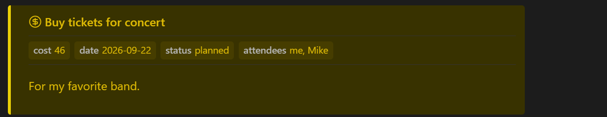

# Callout Tracker

Callout Tracker helps you stay organized in a large vault by collecting important callouts into one clickable overview.

Instead of interrupting your writing to maintain a separate task list or idea document, leave callouts where they naturally belong in your notes. Mark a thought as an `idea`, a task as a `todo`, or a useful suggestion as a custom callout such as `note` or `warning`. Callout Tracker then lets you review those items together, find what still needs to be done, revisit suggestions from your notes, and develop ideas that need more attention.

The overview is grouped by callout type, searchable, and linked back to the source note or Canvas file where each callout appears. This makes it easier to turn scattered thoughts across your vault into an organized workflow. It works locally in your vault and does not use network services.


## Basic usage

Use Callouts in your notes to mark important thoughts, tasks, and suggestions.
```
> [!idea] A useful thought
> More details here.

> [!todo] Finish the draft
```
<br>

Add a `callout-tracker` code block to any note:
````markdown
```callout-tracker
callouts: todo, idea, note
rootfolder: MyRoot
search: myfilter
```
````

`callouts:` is a comma- or space-separated list of callout types.

`rootfolder:` limits the search to that folder and its subfolders. If it is omitted, Callout Tracker uses the default root folder from **Settings → Callout Tracker**. The setting is empty by default, which searches the whole vault.

`search:` is optional. When present, only callouts whose header or body contains the search text are displayed. The search is case-insensitive.

In the settings, use **Ignore prefixes** to exclude matching file and folder names. Enter multiple prefixes separated by commas; whitespace around each value is removed. The field contains `_` by default.

## Customize callouts

Under **Custom callouts** settings you can define the appearance of a callouts and add custom ones. Each definition supports a name, font color, background color, optional border and border color, and optional icon name.
The settings show a live preview, so you can see how the callout will look while you edit it. These styles are applied both to normal Obsidian callouts and to callouts displayed in the tracker.


## Callout properties

Properties let you attach structured values to a callout. Write them directly below the callout header using `key:: value` syntax. Property names cannot contain spaces:

```markdown
> [!cost] Buy tickets for concert
> cost:: 46
> date:: 2026-09-22
> status:: planned
> attendees:: me, Mike
>
> For my favorite band.
```



The property section ends at the first line that is not a property. A blank callout line can be used for readability, but it is not required.

### Filter

Callout Tracker displays these properties in the rendered callout and in tracker results. You can also use them with `filter:`. Put the property name in braces and compare it with a string or number:

````markdown
```callout-tracker
callouts: cost
filter: {cost} > 40
```
````

This shows only callouts whose numeric `cost::` property is greater than 40. For string values, use `=` or `!=`. Numeric values support all comparison operators. Use `&`, `|`, and parentheses to combine conditions.

`filter:` supports `{property}` references, quoted strings, numbers, arithmetic operators (`+`, `-`, `*`, `/`), and the comparison operators `=`, `!=`, `<`, `>`, `<=`, and `>=`:

````markdown
```callout-tracker
callouts: cost
filter: ({cost} + {fee}) / 2 >= 25
```
````

Missing or non-numeric values make an arithmetic comparison fail. `&` means all conditions must match, `|` means either condition may match, and parentheses can group conditions.

Use `exists({property})` when you only want callouts that contain a property, regardless of its value:

````markdown
```callout-tracker
callouts: cost
filter: exists({date}) & {status} = "planned"
```
````

`exists({date})` matches only callouts with a `date::` property. The function can be combined with comparisons, `&`, `|`, and parentheses.

Use `!` before `exists(...)` or a parenthesized condition to negate it:

````markdown
```callout-tracker
callouts: cost
filter: !exists({completed}) & !({status} = "archived")
```
````

`!=` remains the not-equal comparison operator.

The filter also supports these property functions:

- `empty({property})` matches a property that exists but has no value.
- `contains({property}, "text")` matches when the property contains the text, case-insensitively.
- `startsWith({property}, "text")` matches when the property starts with the text, case-insensitively.
- `in({property}, value1, value2, ...)` matches exact string or number values.

For example:

````markdown
```callout-tracker
callouts: hook
filter: contains({tags}, "dragon") & in({status}, "planned", "active")
```
````

### Summary

Use `summary:` to calculate and display a value above the matching callouts. The calculation runs after `search:` and `filter:` have selected the callouts:

````markdown
```callout-tracker
callouts: cost
summary: "Total: " + sum({cost}) + "€ | Average: " + avg({cost}) + "€"
```
````

You can add `summary:` more than once. Each expression is rendered in its own row:

````markdown
```callout-tracker
callouts: cost
summary: "Total: " + sum({cost}) + "€"
summary: "Average: " + avg({cost}) + "€"
summary: "Items: " + count()
```
````

Supported functions are `count()`, `count({property})`, `sum(expression)`, `avg(expression)`, `max(expression)`, `min(expression)`, `median({property})`, and `range({property})`. `count()` counts every matching callout, while `count({property})` counts matching callouts that contain that property. Properties can only be used inside these functions. Numeric arithmetic is supported inside aggregate functions, for example `sum({cost} / 2 + 4.5)`. Missing or non-numeric values are ignored by numeric functions; if no numeric values remain, they return `0`. `median()` returns the middle numeric value, averaging the two middle values when necessary. `range()` returns the maximum numeric value minus the minimum.

Use `display:` to choose what the block renders. It defaults to `All`:

````markdown
```callout-tracker
callouts: cost
display: OnlySummary
summary: "Total: " + sum({cost}) + "€"
```
````

The available values are `All`, `OnlySummary`, and `OnlyCallouts`.

## API for AI agents and integrations

Callout Tracker exposes a local API on the loaded plugin instance. The `search` method returns JSON-friendly results with the callout type, title, text, and file path. Markdown results include a 1-based line number; Canvas results open the `.canvas` file without a line number.

```ts
const tracker = Object.values(app.plugins.plugins)
    .find((plugin) => plugin?.api?.search);

await tracker.api.search({
    callouts: ['hook', 'clue'],
    search: 'dragon',
    filter: 'exists({status}) & {status} = "planned"',
});
```

The `callouts` and `search` options are optional. When omitted, the API uses the configured default root folder and the default callout types `idea`, `note`, and `todo`. The `filter` option supports the same expressions as a tracker block, including `exists`, `empty`, `contains`, `startsWith`, and `in`.

Use `summarize()` when you want a calculated result together with the matching callouts. It uses the same `callouts`, `rootFolder`, `search`, and `filter` options:

```ts
const summary = await tracker.api.summarize({
    callouts: ['cost'],
    filter: 'exists({status}) & {status} = "planned"',
    summary: '"Total: " + sum({cost}) + "€"',
});

// summary.value contains the calculated text.
// summary.callouts contains the matching callouts.
```
