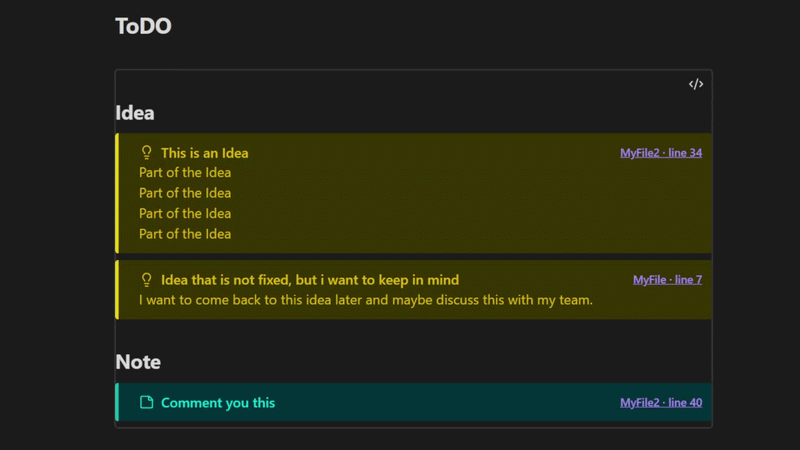
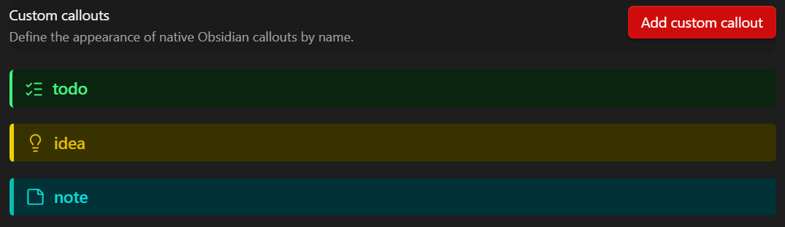

# Callout Tracker

Callout Tracker helps you stay organized in a large vault by collecting important callouts into one clickable overview.

Instead of interrupting your writing to maintain a separate task list or idea document, leave callouts where they naturally belong in your notes. Mark a thought as an `idea`, a task as a `todo`, or a useful suggestion as a custom callout such as `note` or `warning`. Callout Tracker then lets you review those items together, find what still needs to be done, revisit suggestions from your notes, and develop ideas that need more attention.

The overview is grouped by callout type, searchable, and linked back to the exact note and line where each callout appears. This makes it easier to turn scattered thoughts across your vault into an organized workflow. It works locally in your vault and does not use network services.



## Usage

Use Callouts in your notes to mark important thoughts, tasks, and suggestions.
```
> [!idea] A useful thought
> More details here.

> [!todo] Finish the draft
```
<br>

Add a `callout-tracker` code block to any note:
````markdown
```callout-tracker
callouts: todo, idea, note
rootfolder: MyRoot
search: myfilter
```
````

`callouts:` is a comma- or space-separated list of callout types.

`rootfolder:` limits the search to that folder and its subfolders. If it is omitted, Callout Tracker uses the default root folder from **Settings → Callout Tracker**. The setting is empty by default, which searches the whole vault.

`search:` is optional. When present, only callouts whose header or body contains the search text are displayed. The search is case-insensitive.

In the settings, use **Ignore prefixes** to exclude matching file and folder names. Enter multiple prefixes separated by commas; whitespace around each value is removed. The field contains `_` by default.

## Customize callouts

Under **Custom callouts** settings you can define the appearance of a callouts and add custom ones. Each definition supports a name, font color, background color, optional border and border color, and optional icon name.
The settings show a live preview, so you can see how the callout will look while you edit it. These styles are applied both to normal Obsidian callouts and to callouts displayed in the tracker.



## API for AI agents and integrations

Callout Tracker exposes a local API on the loaded plugin instance. The `search` method returns JSON-friendly results with the callout type, title, text, file path, and 1-based line number.

```ts
const tracker = Object.values(app.plugins.plugins)
    .find((plugin) => plugin?.api?.search);

await tracker.api.search({
    callouts: ['hook', 'clue'],
    search: 'dragon',
});
```

The `callouts` and `search` options are optional. When omitted, the API uses the configured default root folder and the default callout types `idea`, `note`, and `todo`.
